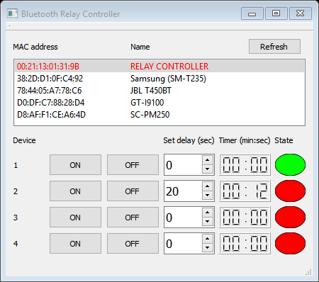
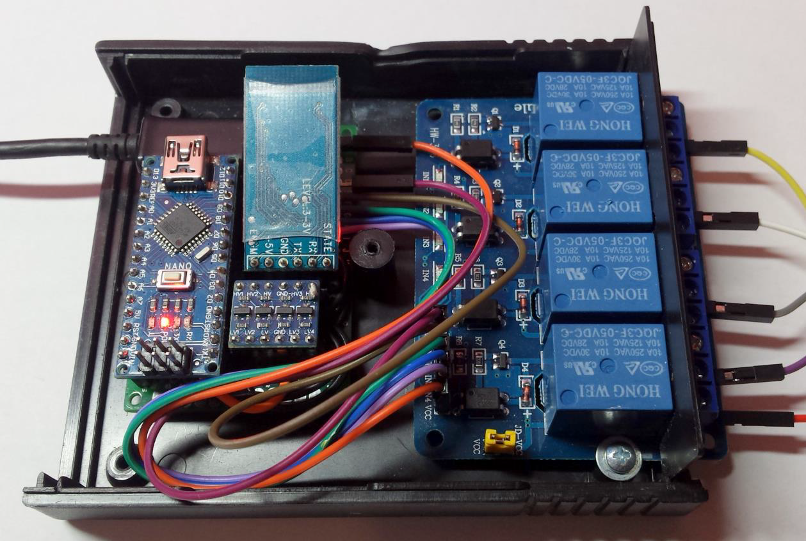

# BtRemoteControl
Application for remote switching devices using Bluetooth
## About
The hardware part is based on the HC-05 module and Arduino Nano.

The PC software was written using Qt.
## Screenshots

